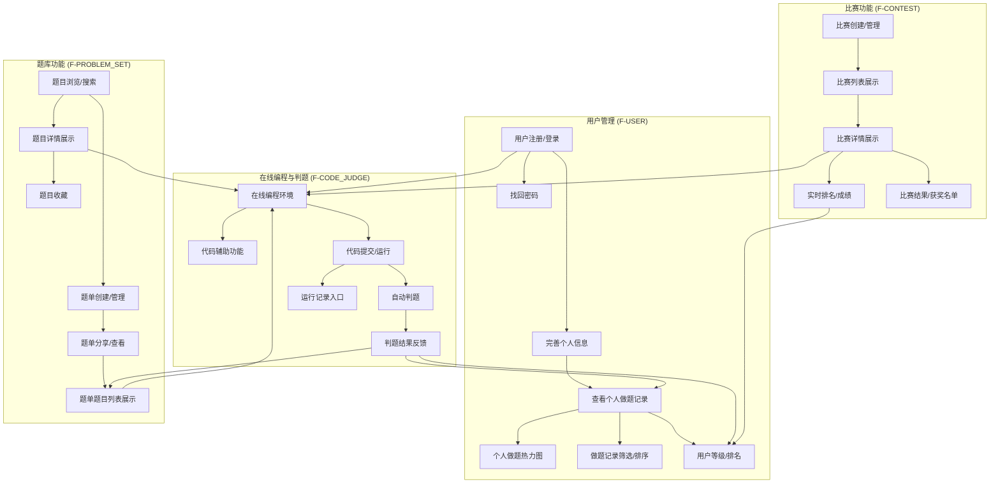
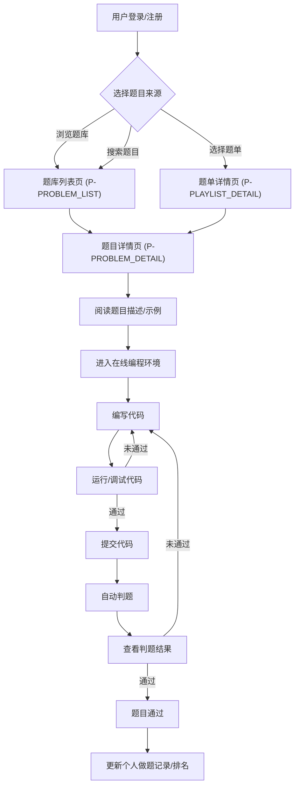
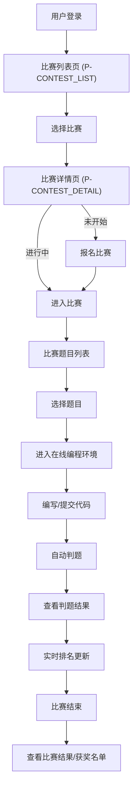
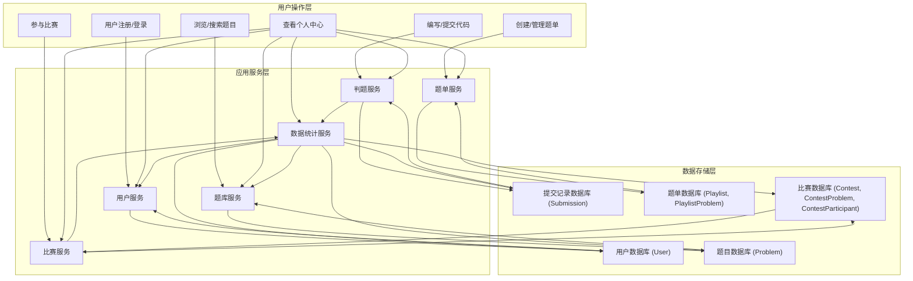

# 乐扣 Online Judge 平台产品需求文档

## 1. 产品概述

### 1.1 产品名称与定位

*   **产品名称:** 乐扣
*   **产品定位:** 一款面向学生科技工作室成员及大学计算机专业学生的Web端在线判题平台，旨在作为编程学习工具，辅助招新练习和日常编程比赛。

### 1.2 产品应用语言

*   **产品应用语言:** 中文

### 1.3 产品愿景与目标

*   **产品愿景:** 成为学生编程学习和竞赛训练的首选平台，通过丰富的题库、高效的判题系统和友好的交互体验，激发用户学习兴趣，提升编程能力。
*   **产品目标:**
    *   提供稳定、高效的在线编程和自动判题服务。
    *   构建全面、易用的编程题库，满足不同难度和类型的学习需求。
    *   支持灵活的比赛组织和管理，满足工作室招新和日常比赛需求。
    *   通过用户激励机制，提升用户活跃度和学习积极性。

### 1.4 产品使用终端

*   **主要终端:** Web端桌面应用
*   **浏览器支持:** Chrome 90+、Firefox 88+、Safari 14+、Edge 90+
*   **分辨率支持:** 768x480及以上分辨率，最佳体验为1920x1080
*   **响应式适配:** 支持768px以上的所有桌面和平板设备

### 1.5 核心价值主张

*   **一站式编程学习与实践:** 提供从题目浏览、在线编程、自动判题到结果反馈的全流程支持。
*   **丰富的学习资源:** 涵盖多种编程语言和题型，满足不同学习阶段的需求。
*   **高效的竞赛组织:** 简化比赛创建和管理流程，实时反馈比赛数据。
*   **激励性的学习环境:** 通过排名、等级等机制，鼓励用户持续学习和进步。

### 1.6 目标用户群体分析

*   **学生科技工作室成员:**
    *   **需求:** 组织招新考核、日常编程训练、内部比赛。
    *   **痛点:** 缺乏统一、高效的判题平台，手动判题效率低下，比赛组织复杂。
    *   **期望:** 稳定可靠的判题系统，灵活的比赛配置，清晰的用户数据统计。
*   **大学计算机专业学生:**
    *   **需求:** 巩固编程知识、练习算法、准备编程竞赛、提升编程技能。
    *   **痛点:** 缺乏系统性的练习平台，题目查找不便，编程环境配置繁琐。
    *   **期望:** 丰富的题库，便捷的在线编程环境，即时判题反馈，个人学习进度追踪。

### 1.7 市场需求与竞品简析

*   **市场需求:** 随着计算机教育的普及和编程竞赛的兴起，对在线判题平台的需求持续增长。学生群体需要一个功能全面、易于使用的平台进行日常练习和比赛。
*   **竞品简析:**
    *   **LeetCode/牛客网:** 功能全面，题库丰富，但可能对初学者不够友好，且部分高级功能需付费。
    *   **Codeforces/AtCoder:** 专注于竞技编程，比赛体验优秀，但界面和功能对非竞赛用户可能过于复杂。
    *   **本产品优势:** 专注于编程学习工具和竞赛训练平台，提供更贴近学生科技工作室和大学计算机专业学生需求的定制化功能，如自定义题单、招新比赛模式等，同时保持简洁友好的用户体验。

### 1.8 浏览器兼容性要求

*   **桌面端:**
    *   Chrome: 最新两个稳定版本
    *   Firefox: 最新两个稳定版本
    *   Safari: 最新两个稳定版本
    *   Edge: 最新两个稳定版本
*   **移动端:** 暂不作为主要适配目标，但需保证基本可访问性。

## 2. 功能规格

### 2.1 功能详述

#### 2.1.1 用户管理模块（Module ID: F-USER）

*   **F-USER-001 用户注册:**
    *   **描述:** 用户通过邮箱/手机号注册账号，设置密码。
    *   **优先级:** 高
*   **F-USER-002 用户登录:**
    *   **描述:** 用户通过注册的账号和密码登录平台。
    *   **优先级:** 高
*   **F-USER-003 找回密码:**
    *   **描述:** 用户通过注册邮箱/手机号找回或重置密码。
    *   **优先级:** 高
*   **F-USER-004 完善个人信息:**
    *   **描述:** 用户登录后可完善个人昵称、简介等信息。
    *   **优先级:** 中
*   **F-USER-005 查看个人做题记录:**
    *   **描述:** 用户可查看个人所有做题记录，包括提交时间、题目、判题结果、代码等。
    *   **优先级:** 高
*   **F-USER-006 个人做题热力图:**
    *   **描述:** 在个人中心展示做题热力图，直观反映用户活跃度和做题情况。
    *   **优先级:** 中
*   **F-USER-007 做题记录筛选与排序:**
    *   **描述:** 用户可按时间（最新/最旧）、题目难度（简单/中等/困难）、判题结果（通过/未通过）、题目类型筛选或排序做题记录。
    *   **优先级:** 高
*   **F-USER-008 用户等级划分与排名:**
    *   **描述:** 根据用户的做题数量和准确率进行等级划分或全平台排名，激励用户学习。
    *   **优先级:** 高

#### 2.1.2 题库功能模块（Module ID: F-PROBLEM_SET）

*   **F-PROBLEM_SET-001 题目浏览与搜索:**
    *   **描述:** 提供大量的编程题目，支持通过题型（基本编程题、模拟题、算法题）、标签、难度（简单、中等、困难）、关键词搜索题目。
    *   **优先级:** 高
*   **F-PROBLEM_SET-002 题目详情展示:**
    *   **描述:** 展示题目描述、输入输出示例、相关标签。
    *   **优先级:** 高
*   **F-PROBLEM_SET-003 题目收藏:**
    *   **描述:** 用户可收藏感兴趣的题目，方便后续查找。
    *   **优先级:** 中
*   **F-PROBLEM_SET-004 题单创建与管理:**
    *   **描述:** 用户可自定义创建题单，包括添加题目、删除题目、调整题目顺序、设置题单公开/私有、为题单添加描述和标签。
    *   **优先级:** 高
*   **F-PROBLEM_SET-005 题单分享与查看:**
    *   **描述:** 用户可分享自定义题单，也可查看官方或其他用户分享的题单。
    *   **优先级:** 高
*   **F-PROBLEM_SET-006 题单题目列表展示:**
    *   **描述:** 在题单详情页，题目列表可按题目顺序、题目难度、题目类型展示，并显示用户在该题单中的做题进度和每道题的通过率。
    *   **优先级:** 高

#### 2.1.3 在线编程与判题模块（Module ID: F-CODE_JUDGE）

*   **F-CODE_JUDGE-001 在线编程环境:**
    *   **描述:** 提供Web端的代码编辑区域，支持多种编程语言（C、C++、Java、Python、Go、JavaScript、Rust、PHP、Swift、Kotlin、Cangjie、TypeScript）。
    *   **优先级:** 高
*   **F-CODE_JUDGE-002 代码辅助功能:**
    *   **描述:** 支持语法高亮、代码格式化、调试功能。
    *   **优先级:** 高
*   **F-CODE_JUDGE-003 代码提交与运行:**
    *   **描述:** 用户可直接在平台上编写代码，并进行编译和运行。
    *   **优先级:** 高
*   **F-CODE_JUDGE-004 自动判题:**
    *   **描述:** 用户提交代码后，系统自动对代码进行编译和执行，并根据预设的测试数据检验程序的正确性。
    *   **优先级:** 高
*   **F-CODE_JUDGE-005 判题结果反馈:**
    *   **描述:** 判题结果显示为通过、答案错误、超时、超内存、运行时错误、编译错误、系统错误、安全限制、输出格式错误。同时返回程序使用的内存、运行时间等信息。
    *   **优先级:** 高
*   **F-CODE_JUDGE-006 运行记录入口:**
    *   **描述:** 在题目详情页提供运行记录入口，方便用户查看历史提交和判题结果。
    *   **优先级:** 中

#### 2.1.4 比赛功能模块（Module ID: F-CONTEST）

*   **F-CONTEST-001 比赛创建与管理:**
    *   **描述:** 支持创建ACM/ICPC规则的编程比赛，组织者可以设置比赛时间、题目数量、参赛人员等信息。
    *   **优先级:** 高
*   **F-CONTEST-002 比赛列表展示:**
    *   **描述:** 展示比赛名称、比赛时间、比赛状态（未开始/进行中/已结束）、参赛人数、比赛规则简介。
    *   **优先级:** 高
*   **F-CONTEST-003 比赛详情展示:**
    *   **描述:** 展示比赛名称、比赛时间、比赛状态、参赛人数、比赛规则简介、比赛题目列表、实时排名入口。
    *   **优先级:** 高
*   **F-CONTEST-004 实时排名与成绩:**
    *   **描述:** 比赛过程中，实时显示参赛者的排名和成绩，包括题目通过情况、剩余时间、提交次数、其他参赛者的提交动态。
    *   **优先级:** 高
*   **F-CONTEST-005 比赛结果与获奖名单:**
    *   **描述:** 比赛结束后，生成比赛结果和获奖名单。
    *   **优先级:** 高

### 2.2 功能模块间的关系图

## 3. 用户流程

### 3.1 用户旅程地图

| 阶段 | 用户目标 | 行为 | 触点 | 情绪 | 痛点 | 机会点 |
|---|---|---|---|---|---|---|
| **发现与注册** | 了解平台，注册账号 | 访问官网，浏览介绍，点击注册 | 乐扣官网、注册/登录页（P-REGISTER_LOGIN） | 期待、好奇 | 注册流程复杂，信息填写繁琐 | 简化注册流程，提供清晰的平台介绍 |
| **日常练习** | 提升编程能力，巩固知识 | 浏览题库，搜索题目，在线编程，提交代码 | 首页（P-HOME）、题库列表页（P-PROBLEM_LIST）、题目详情页（P-PROBLEM_DETAIL） | 专注、满足 | 题目查找不便，判题反馈不及时 | 优化搜索功能，提供即时判题结果 |
| **专题训练** | 针对性学习，完成特定任务 | 创建/查看题单，按题单练习 | 题单列表页（P-PLAYLIST_LIST）、题单详情页（P-PLAYLIST_DETAIL） | 有序、高效 | 题单管理不便，无法追踪进度 | 增强题单管理功能，显示做题进度 |
| **参与比赛** | 检验能力，体验竞技 | 浏览比赛，报名，参加比赛，查看排名 | 比赛列表页（P-CONTEST_LIST）、比赛详情页（P-CONTEST_DETAIL） | 紧张、兴奋 | 比赛信息不全，排名更新慢 | 提供详细比赛信息，实时更新排名 |
| **个人回顾** | 总结学习，查看进步 | 查看个人中心，分析做题记录 | 个人中心页（P-PROFILE） | 反思、成就 | 数据展示不直观，无法多维度分析 | 提供做题热力图，多维度筛选记录 |

### 3.2 关键业务流程图

#### 3.2.1 用户做题流程

#### 3.2.2 比赛参与流程

### 3.3 各场景下的用户操作步骤

#### 3.3.1 日常学习和巩固编程知识

1.  **浏览题目:**
    *   用户访问乐扣首页（P-HOME），查看最新题目或推荐题单。
    *   点击“题库”导航，进入题库列表页（P-PROBLEM_LIST）。
    *   在题库列表页（P-PROBLEM_LIST）通过难度、标签、题型、关键词筛选或搜索题目。
2.  **在线练习:**
    *   在题库列表页（P-PROBLEM_LIST）点击题目名称，进入题目详情页（P-PROBLEM_DETAIL）。
    *   在题目详情页（P-PROBLEM_DETAIL）阅读题目描述、输入输出示例。
    *   在右侧编程区域选择编程语言，编写代码。
    *   点击“运行”按钮，测试代码。
    *   点击“提交”按钮，提交代码进行自动判题。
    *   查看判题结果，根据结果调整代码并再次提交，或查看运行记录。
3.  **回顾与总结:**
    *   点击“个人中心”导航，进入个人中心页（P-PROFILE）。
    *   查看做题热力图、做题总数、通过题目数、不同难度题目通过情况。
    *   在提交记录列表，按时间、难度、判题结果、题目类型筛选或排序，查看历史提交代码和判题详情。

#### 3.3.2 准备编程竞赛或招新考核

1.  **查找比赛:**
    *   用户访问乐扣首页（P-HOME），查看热门比赛或公告。
    *   点击“比赛”导航，进入比赛列表页（P-CONTEST_LIST）。
    *   在比赛列表页（P-CONTEST_LIST）查看比赛名称、时间、状态、参赛人数、规则简介。
2.  **报名与参赛:**
    *   点击比赛名称，进入比赛详情页（P-CONTEST_DETAIL）。
    *   如果比赛未开始，点击“报名”按钮。
    *   比赛开始后，点击“进入比赛”按钮，进入比赛界面。
    *   在比赛界面查看比赛题目列表，选择题目进行在线编程和提交。
3.  **关注比赛进程:**
    *   在比赛界面实时关注排名、题目通过情况、剩余时间、提交次数、其他参赛者的提交动态。
4.  **查看结果:**
    *   比赛结束后，在比赛详情页（P-CONTEST_DETAIL）查看最终比赛结果和获奖名单。

## 4. 数据流设计

### 4.1 数据结构与关系

#### 4.1.1 用户数据（User）

| 字段名 | 数据类型 | 描述 | 备注 |
|---|---|---|---|
| `user_id` | UUID | 用户唯一标识 | 主键 |
| `username` | String | 用户名/登录账号 | 唯一 |
| `password_hash` | String | 密码哈希值 | 安全存储 |
| `email` | String | 邮箱 | 可用于找回密码 |
| `nickname` | String | 用户昵称 | 可修改 |
| `bio` | Text | 个人简介 | 可修改 |
| `level` | Integer | 用户等级 | 根据做题数据计算 |
| `rank` | Integer | 用户排名 | 根据做题数据计算 |
| `total_solved` | Integer | 总通过题目数 | 默认0 |
| `accuracy_rate` | Float | 准确率 | 默认0.0 |
| `last_login_at` | Timestamp | 最后登录时间 | |
| `created_at` | Timestamp | 注册时间 | |

#### 4.1.2 题目数据（Problem）

| 字段名 | 数据类型 | 描述 | 备注 |
|---|---|---|---|
| `problem_id` | UUID | 题目唯一标识 | 主键 |
| `title` | String | 题目名称 | |
| `description` | Text | 题目描述 | 支持Markdown |
| `input_example` | Text | 输入示例 | |
| `output_example` | Text | 输出示例 | |
| `difficulty` | Enum | 难度等级 | 简单/中等/困难 |
| `type` | Enum | 题目类型 | 基本编程题/模拟题/算法题 |
| `tags` | Array<String> | 题目标签 | |
| `source` | String | 题目来源 | 如：LeetCode、Codeforces |
| `created_at` | Timestamp | 创建时间 | |
| `total_submissions` | Integer | 总提交次数 | 默认0 |
| `total_accepted` | Integer | 总通过次数 | 默认0 |
| `pass_rate` | Float | 通过率 | `total_accepted / total_submissions` |

#### 4.1.3 提交记录数据（Submission）

| 字段名 | 数据类型 | 描述 | 备注 |
|---|---|---|---|
| `submission_id` | UUID | 提交记录唯一标识 | 主键 |
| `user_id` | UUID | 提交用户ID | 外键关联User |
| `problem_id` | UUID | 提交题目ID | 外键关联Problem |
| `language` | String | 编程语言 | 如：C++, Python |
| `code` | Text | 提交的代码 | |
| `submit_time` | Timestamp | 提交时间 | |
| `judge_result` | Enum | 判题结果 | 通过/答案错误/超时/超内存/运行时错误/编译错误/系统错误/安全限制/输出格式错误 |
| `memory_used` | Integer | 使用内存（KB） | |
| `time_used` | Integer | 运行时间（ms） | |
| `test_cases_passed` | Integer | 通过测试用例数 | |
| `total_test_cases` | Integer | 总测试用例数 | |

#### 4.1.4 题单数据（Playlist）

| 字段名 | 数据类型 | 描述 | 备注 |
|---|---|---|---|
| `playlist_id` | UUID | 题单唯一标识 | 主键 |
| `creator_id` | UUID | 创建者用户ID | 外键关联User |
| `title` | String | 题单名称 | |
| `description` | Text | 题单描述 | |
| `tags` | Array<String> | 题单标签 | |
| `is_public` | Boolean | 是否公开 | 默认私有 |
| `created_at` | Timestamp | 创建时间 | |
| `updated_at` | Timestamp | 最后更新时间 | |

#### 4.1.5 题单-题目关联数据（PlaylistProblem）

| 字段名 | 数据类型 | 描述 | 备注 |
|---|---|---|---|
| `playlist_id` | UUID | 题单ID | 联合主键，外键关联Playlist |
| `problem_id` | UUID | 题目ID | 联合主键，外键关联Problem |
| `order` | Integer | 题目在题单中的顺序 | |
| `added_at` | Timestamp | 添加时间 | |

#### 4.1.6 比赛数据（Contest）

| 字段名 | 数据类型 | 描述 | 备注 |
|---|---|---|---|
| `contest_id` | UUID | 比赛唯一标识 | 主键 |
| `organizer_id` | UUID | 组织者用户ID | 外键关联User |
| `name` | String | 比赛名称 | |
| `start_time` | Timestamp | 比赛开始时间 | |
| `end_time` | Timestamp | 比赛结束时间 | |
| `status` | Enum | 比赛状态 | 未开始/进行中/已结束 |
| `rule_type` | Enum | 比赛规则类型 | ACM/ICPC |
| `description` | Text | 比赛规则简介 | |
| `max_participants` | Integer | 最大参赛人数 | |
| `created_at` | Timestamp | 创建时间 | |

#### 4.1.7 比赛-题目关联数据（ContestProblem）

| 字段名 | 数据类型 | 描述 | 备注 |
|---|---|---|---|
| `contest_id` | UUID | 比赛ID | 联合主键，外键关联Contest |
| `problem_id` | UUID | 题目ID | 联合主键，外键关联Problem |
| `problem_alias` | String | 比赛中题目的别名 | 如：A, B, C |

#### 4.1.8 比赛参与者数据（ContestParticipant）

| 字段名 | 数据类型 | 描述 | 备注 |
|---|---|---|---|
| `contest_id` | UUID | 比赛ID | 联合主键，外键关联Contest |
| `user_id` | UUID | 参赛用户ID | 联合主键，外键关联User |
| `join_time` | Timestamp | 参与时间 | |
| `score` | Integer | 比赛得分 | |
| `rank` | Integer | 比赛排名 | |
| `penalty_time` | Integer | 罚时 | |

### 4.2 关键数据流向图

### 4.3 数据存储与处理原则

*   **安全性:** 用户密码采用加盐哈希存储，敏感信息加密传输。
*   **一致性:** 采用事务管理确保数据操作的原子性、一致性、隔离性和持久性。
*   **可扩展性:** 数据库设计考虑未来数据量增长，支持水平扩展。
*   **实时性:** 判题结果、比赛排名等关键数据需保证实时更新和反馈。
*   **备份与恢复:** 定期进行数据备份，制定完善的数据恢复策略。
*   **性能优化:** 对高频查询和写入操作进行索引优化，缓存常用数据。
*   **判题沙箱:** 判题服务在独立的沙箱环境中运行用户代码，确保系统安全和资源隔离。

## 5. 页面规格

### 5.1 页面概览

#### 5.1.1 整体布局架构

*   **布局模式:** Web端响应式布局 - 固定顶部导航栏 + 可折叠左侧菜单 + 主内容区 + 可选右侧面板
*   **空间分配策略:**
    *   顶部导航栏：固定高度60px。
    *   左侧菜单：展开时宽度200-240px，折叠时宽度48-56px。
    *   主内容区：动态宽度，最小宽度720px，占据剩余空间。
    *   右侧面板：仅在屏幕宽度≥1440px且功能确实必要时使用，宽度280-320px，且必须在布局中占据独立空间，绝对不能遮挡主内容区，并确保主内容区宽度≥720px。
*   **导航体系:** 顶部主导航 + 左侧功能菜单 + 面包屑导航（部分页面）。
*   **交互模式:** 页面切换 + 模态弹窗 + 侧边抽屉 + 右键菜单。
*   **右侧面板使用:** 严格限制使用，仅用于辅助功能，且必须提供主内容区替代方案。

#### 5.1.2 页面列表

| 页面ID | 页面名称 | 核心功能 | 布局类型 | 右侧面板 |
|---|---|---|---|---|
| P-HOME | 首页 | 信息概览、导航入口 | 二栏布局 | 否 |
| P-REGISTER_LOGIN | 注册/登录页 | 用户身份认证 | 单栏布局 | 否 |
| P-FORGOT_PASSWORD | 找回密码页 | 密码重置 | 单栏布局 | 否 |
| P-PROBLEM_LIST | 题库列表页 | 题目浏览、搜索、筛选 | 二栏布局 | 否 |
| P-PROBLEM_DETAIL | 题目详情页 | 题目描述、在线编程、判题 | 二栏布局（左右分栏） | 否 |
| P-PLAYLIST_LIST | 题单列表页 | 题单浏览、创建、管理 | 二栏布局 | 否 |
| P-PLAYLIST_DETAIL | 题单详情页 | 题单题目列表、进度展示 | 二栏布局 | 否 |
| P-CONTEST_LIST | 比赛列表页 | 比赛浏览、状态查看 | 二栏布局 | 否 |
| P-CONTEST_DETAIL | 比赛详情页 | 比赛信息、题目、实时排名 | 二栏布局 | 否 |
| P-PROFILE | 个人中心页 | 个人信息、做题统计、记录 | 二栏布局 | 否 |

### 5.2 页面详情

#### 5.2.1 首页（P-HOME）

**布局架构设计：**
- 页面类型：信息概览页，提供核心功能入口和最新动态。
- 布局模式：二栏布局（左侧菜单+主内容区）。
- 空间分配：顶部导航栏固定，左侧菜单可折叠，主内容区占据剩余空间。

**页面布局架构：**
- 顶部导航栏：Logo、主导航菜单（首页、题库、比赛、题单、个人中心）、搜索框、用户头像/登录注册入口 - 建议高度60px，固定定位。
- 左侧菜单：功能导航菜单（可折叠，展开宽度200px，折叠宽度48px） - 建议宽度200px(展开)/48px(折叠)。
- 主内容区域：核心展示区域，建议最小宽度720px。
  - 页面头部：页面标题“首页”、公告/新闻区域 - 建议高度60px。
  - 内容展示区域：
    - 用户排名模块：展示全平台用户排名Top N。
    - 推荐题单模块：展示官方或热门推荐题单列表。
    - 最新题目模块：展示最新发布的题目列表。
    - 快速入口：如“开始练习”、“参加比赛”等按钮。
  - 分页区域：如推荐题单、最新题目列表的分页控件 - 建议高度40px。
- 右侧面板：不使用。

**响应式适配策略：**
- 大屏幕(≥1440px)：二栏布局，左侧200px + 主内容区充满。
- 中屏幕(1200-1439px)：二栏布局，左侧200px + 主内容区充满剩余空间。
- 小屏幕(768-1199px)：左侧菜单折叠或抽屉式，主内容区充满。
- 移动端(<768px)：单栏布局，左侧菜单抽屉化，内容单列显示。

**组件尺寸规范：**
- 按钮尺寸：建议高度36px。
- 输入框：建议搜索框36px高度。
- 卡片：推荐题单、最新题目卡片建议最小高度120px，宽度自适应。
- 列表行高：用户排名列表行高建议36px。
- 图标尺寸：导航图标20px，操作图标16px。
- 间距规范：模块间距24px，组件间距16px。

**核心功能：**
展示用户排名、公告/新闻、推荐题单、最新题目，提供快速导航入口。

**交互设计：**
- 鼠标交互：导航菜单、卡片、按钮悬停效果。
- 键盘交互：Tab键导航，Enter键确认。
- 状态管理：无特定状态保持。

**页面间跳转关系：**
| 触发组件 | 交互类型 | 目标页面 | 传递参数 | 展示方式 |
|---|---|---|---|---|
| 导航菜单“题库” | 点击 | 题库列表页（P-PROBLEM_LIST） | 无 | 主内容区切换 |
| 导航菜单“比赛” | 点击 | 比赛列表页（P-CONTEST_LIST） | 无 | 主内容区切换 |
| 导航菜单“题单” | 点击 | 题单列表页（P-PLAYLIST_LIST） | 无 | 主内容区切换 |
| 导航菜单“个人中心” | 点击 | 个人中心页（P-PROFILE） | 无 | 主内容区切换 |
| 最新题目卡片 | 点击 | 题目详情页（P-PROBLEM_DETAIL） | 题目ID | 页面跳转 |
| 推荐题单卡片 | 点击 | 题单详情页（P-PLAYLIST_DETAIL） | 题单ID | 页面跳转 |
| 用户头像/登录注册入口 | 点击 | 注册/登录页（P-REGISTER_LOGIN） | 无 | 页面跳转 |

#### 5.2.2 注册/登录页（P-REGISTER_LOGIN）

**布局架构设计：**
- 页面类型：表单页，用于用户身份认证。
- 布局模式：单栏居中布局。
- 空间分配：页面主体内容居中显示，两侧留白。

**页面布局架构：**
- 顶部导航栏：仅显示Logo和产品名称 - 建议高度60px。
- 主内容区域：居中显示，建议宽度400-600px。
  - 注册/登录表单区域：包含用户名/邮箱、密码、确认密码（注册时）、验证码等输入框，以及注册/登录按钮。
  - 找回密码链接。
- 右侧面板：不使用。

**响应式适配策略：**
- 大屏幕(≥1440px)：单栏居中布局，表单区域宽度固定。
- 中屏幕(1200-1439px)：单栏居中布局，表单区域宽度固定。
- 小屏幕(768-1199px)：单栏居中布局，表单区域宽度自适应，最大宽度限制。
- 移动端(<768px)：单栏布局，表单区域宽度充满屏幕，适当调整间距。

**组件尺寸规范：**
- 按钮尺寸：建议高度40px。
- 输入框：建议高度40px。
- 间距规范：表单项间距16px，按钮与表单间距24px。

**核心功能：**
用户注册、用户登录。

**交互设计：**
- 鼠标交互：输入框聚焦效果，按钮点击效果。
- 键盘交互：Tab键切换输入框，Enter键提交表单。
- 状态管理：登录成功后保存用户会话信息。

**页面间跳转关系：**
| 触发组件 | 交互类型 | 目标页面 | 传递参数 | 展示方式 |
|---|---|---|---|---|
| 注册按钮 | 点击 | 注册/登录页（P-REGISTER_LOGIN） | 无 | 页面内切换（注册/登录Tab） |
| 登录按钮 | 点击 | 首页（P-HOME） | 无 | 页面跳转 |
| 找回密码链接 | 点击 | 找回密码页（P-FORGOT_PASSWORD） | 无 | 页面跳转 |
| 顶部Logo | 点击 | 首页（P-HOME） | 无 | 页面跳转 |

#### 5.2.3 找回密码页（P-FORGOT_PASSWORD）

**布局架构设计：**
- 页面类型：表单页，用于密码重置。
- 布局模式：单栏居中布局。
- 空间分配：页面主体内容居中显示，两侧留白。

**页面布局架构：**
- 顶部导航栏：仅显示Logo和产品名称 - 建议高度60px。
- 主内容区域：居中显示，建议宽度400-600px。
  - 找回密码表单区域：包含邮箱/手机号输入框、验证码输入框、新密码输入框、确认新密码输入框，以及提交按钮。
- 右侧面板：不使用。

**响应式适配策略：**
- 大屏幕(≥1440px)：单栏居中布局，表单区域宽度固定。
- 中屏幕(1200-1439px)：单栏居中布局，表单区域宽度固定。
- 小屏幕(768-1199px)：单栏居中布局，表单区域宽度自适应，最大宽度限制。
- 移动端(<768px)：单栏布局，表单区域宽度充满屏幕，适当调整间距。

**组件尺寸规范：**
- 按钮尺寸：建议高度40px。
- 输入框：建议高度40px。
- 间距规范：表单项间距16px，按钮与表单间距24px。

**核心功能：**
用户密码重置。

**交互设计：**
- 鼠标交互：输入框聚焦效果，按钮点击效果。
- 键盘交互：Tab键切换输入框，Enter键提交表单。
- 状态管理：无特定状态保持。

**页面间跳转关系：**
| 触发组件 | 交互类型 | 目标页面 | 传递参数 | 展示方式 |
|---|---|---|---|---|
| 提交按钮 | 点击 | 注册/登录页（P-REGISTER_LOGIN） | 无 | 页面跳转 |
| 顶部Logo | 点击 | 首页（P-HOME） | 无 | 页面跳转 |

#### 5.2.4 题库列表页（P-PROBLEM_LIST）

**布局架构设计：**
- 页面类型：列表页，用于展示和筛选题目。
- 布局模式：二栏布局（左侧菜单+主内容区）。
- 空间分配：顶部导航栏固定，左侧菜单可折叠，主内容区占据剩余空间。

**页面布局架构：**
- 顶部导航栏：Logo、主导航菜单、搜索框、用户头像/登录注册入口 - 建议高度60px，固定定位。
- 左侧菜单：功能导航菜单（可折叠，展开宽度200px，折叠宽度48px） - 建议宽度200px(展开)/48px(折叠)。
- 主内容区域：核心展示区域，建议最小宽度720px。
  - 页面头部：页面标题“题库”、面包屑导航（可选） - 建议高度48px。
  - 工具栏区域：搜索框（关键词搜索）、筛选条件（难度、题型、标签） - 建议高度48px。
  - 内容展示区域：题目列表（表格或卡片形式），显示题目名称、难度、通过率、标签等信息。
  - 分页区域：分页控件，显示总题目数、每页条数选择 - 建议高度40px。
- 右侧面板：不使用。

**响应式适配策略：**
- 大屏幕(≥1440px)：二栏布局，左侧200px + 主内容区充满。
- 中屏幕(1200-1439px)：二栏布局，左侧200px + 主内容区充满剩余空间。
- 小屏幕(768-1199px)：左侧菜单折叠或抽屉式，内容改为2列布局（如果使用卡片），表格列数自适应。
- 移动端(<768px)：单栏布局，左侧菜单抽屉化，内容单列显示。

**组件尺寸规范：**
- 按钮尺寸：建议高度32px。
- 输入框：建议搜索框36px高度，筛选下拉框32px高度。
- 表格行高：建议36px。
- 间距规范：工具栏与内容区间距16px，列表项间距8px。

**核心功能：**
题目浏览、通过关键词、题型、标签、难度搜索题目。

**数据结构：**
| 列名 | 数据类型 | 宽度建议 | 是否可排序 | 操作功能 |
|---|---|---|---|---|
| 题目ID | String | 80px | 是 | 无 |
| 题目名称 | String | 300px | 是 | 点击进入题目详情 |
| 难度 | Enum | 100px | 是 | 筛选 |
| 题型 | Enum | 120px | 是 | 筛选 |
| 标签 | Array<String> | 150px | 否 | 筛选 |
| 通过率 | Float | 100px | 是 | 无 |
| 操作 | Button | 80px | 否 | 收藏、添加到题单 |

**交互设计：**
- 鼠标交互：题目名称悬停高亮，筛选条件点击展开。
- 键盘交互：Tab键导航，Enter键确认搜索。
- 状态管理：搜索条件、筛选条件、分页状态保持。

**页面间跳转关系：**
| 触发组件 | 交互类型 | 目标页面 | 传递参数 | 展示方式 |
|---|---|---|---|---|
| 题目名称 | 点击 | 题目详情页（P-PROBLEM_DETAIL） | 题目ID | 页面跳转 |
| 收藏按钮 | 点击 | 题库列表页（P-PROBLEM_LIST） | 题目ID | 页面内操作（收藏状态更新） |
| 添加到题单按钮 | 点击 | 题单列表页（P-PLAYLIST_LIST） | 题目ID | 模态弹窗（选择题单） |
| 导航菜单“首页” | 点击 | 首页（P-HOME） | 无 | 主内容区切换 |
| 导航菜单“比赛” | 点击 | 比赛列表页（P-CONTEST_LIST） | 无 | 主内容区切换 |
| 导航菜单“题单” | 点击 | 题单列表页（P-PLAYLIST_LIST） | 无 | 主内容区切换 |
| 导航菜单“个人中心” | 点击 | 个人中心页（P-PROFILE） | 无 | 主内容区切换 |

#### 5.2.5 题目详情页（P-PROBLEM_DETAIL）

**布局架构设计：**
- 页面类型：详情页，包含题目描述和在线编程环境。
- 布局模式：二栏布局（左右分栏），左侧题目详情，右侧编程区域。
- 空间分配：顶部导航栏固定，左侧菜单可折叠，主内容区左右分栏。

**页面布局架构：**
- 顶部导航栏：Logo、主导航菜单、搜索框、用户头像/登录注册入口 - 建议高度60px，固定定位。
- 左侧菜单：功能导航菜单（可折叠，展开宽度200px，折叠宽度48px） - 建议宽度200px(展开)/48px(折叠)。
- 主内容区域：核心展示区域，建议最小宽度720px，左右分栏。
  - 左侧题目详情区域：建议宽度占比40%-50%。
    - 页面头部：题目名称、标签（在题目标题下方）、面包屑导航 - 建议高度48px。
    - 内容展示区域：题目描述、输入输出示例。
    - 底部区域：运行记录入口（链接或按钮）。
  - 右侧编程区域：建议宽度占比50%-60%。
    - 代码编辑器：支持语法高亮、代码格式化、调试功能。
    - 编程语言选择器。
    - 提交按钮、运行按钮。
- 右侧面板：不使用。

**响应式适配策略：**
- 大屏幕(≥1440px)：二栏布局，左侧200px + 主内容区左右分栏。
- 中屏幕(1200-1439px)：二栏布局，左侧200px + 主内容区左右分栏。
- 小屏幕(768-1199px)：左侧菜单折叠或抽屉式，主内容区左右分栏（可考虑在小屏幕下切换为上下布局）。
- 移动端(<768px)：单栏布局，左侧菜单抽屉化，题目详情和编程区域切换显示或上下堆叠。

**组件尺寸规范：**
- 按钮尺寸：提交/运行按钮建议高度40px。
- 代码编辑器：高度自适应，最小高度300px。
- 间距规范：左右分栏间距16px，内容模块间距16px。

**核心功能：**
阅读题目描述、查看示例输入/输出、进入在线编程环境、编写代码、编译运行、提交代码、查看判题结果、收藏题目、添加到题单、查看提交记录。

**交互设计：**
- 鼠标交互：代码编辑器内光标操作，按钮点击。
- 键盘交互：代码编辑器内快捷键（如格式化、调试），Tab键导航。
- 状态管理：代码编辑器内容自动保存（草稿），判题结果实时反馈。

**页面间跳转关系：**
| 触发组件 | 交互类型 | 目标页面 | 传递参数 | 展示方式 |
|---|---|---|---|---|
| 提交按钮 | 点击 | 题目详情页（P-PROBLEM_DETAIL） | 题目ID、提交代码 | 页面内更新（判题结果显示） |
| 运行记录入口 | 点击 | 个人中心页（P-PROFILE） | 题目ID（筛选） | 页面跳转 |
| 收藏按钮 | 点击 | 题目详情页（P-PROBLEM_DETAIL） | 题目ID | 页面内操作（收藏状态更新） |
| 添加到题单按钮 | 点击 | 题单列表页（P-PLAYLIST_LIST） | 题目ID | 模态弹窗（选择题单） |
| 导航菜单“题库” | 点击 | 题库列表页（P-PROBLEM_LIST） | 无 | 主内容区切换 |
| 导航菜单“首页” | 点击 | 首页（P-HOME） | 无 | 主内容区切换 |

#### 5.2.6 题单列表页（P-PLAYLIST_LIST）

**布局架构设计：**
- 页面类型：列表页，用于展示和管理题单。
- 布局模式：二栏布局（左侧菜单+主内容区）。
- 空间分配：顶部导航栏固定，左侧菜单可折叠，主内容区占据剩余空间。

**页面布局架构：**
- 顶部导航栏：Logo、主导航菜单、搜索框、用户头像/登录注册入口 - 建议高度60px，固定定位。
- 左侧菜单：功能导航菜单（可折叠，展开宽度200px，折叠宽度48px） - 建议宽度200px(展开)/48px(折叠)。
- 主内容区域：核心展示区域，建议最小宽度720px。
  - 页面头部：页面标题“题单”、面包屑导航（可选）、“创建题单”按钮 - 建议高度48px。
  - 工具栏区域：搜索框（关键词搜索）、筛选条件（公开/私有、标签） - 建议高度48px。
  - 内容展示区域：题单列表（卡片或列表形式），显示题单名称、描述、标签、创建者、题目数量、公开状态等信息。
  - 分页区域：分页控件 - 建议高度40px。
- 右侧面板：不使用。

**响应式适配策略：**
- 大屏幕(≥1440px)：二栏布局，左侧200px + 主内容区充满。
- 中屏幕(1200-1439px)：二栏布局，左侧200px + 主内容区充满剩余空间。
- 小屏幕(768-1199px)：左侧菜单折叠或抽屉式，内容改为2列布局（如果使用卡片），列表列数自适应。
- 移动端(<768px)：单栏布局，左侧菜单抽屉化，内容单列显示。

**组件尺寸规范：**
- 按钮尺寸：创建题单按钮建议高度36px。
- 卡片：题单卡片建议最小高度100px，宽度自适应。
- 间距规范：工具栏与内容区间距16px，列表项间距8px。

**核心功能：**
浏览、搜索、筛选题单，创建新题单。

**数据结构：**
| 列名 | 数据类型 | 宽度建议 | 是否可排序 | 操作功能 |
|---|---|---|---|---|
| 题单名称 | String | 200px | 是 | 点击进入题单详情 |
| 描述 | String | 300px | 否 | 无 |
| 标签 | Array<String> | 150px | 否 | 筛选 |
| 创建者 | String | 120px | 是 | 无 |
| 题目数量 | Integer | 80px | 是 | 无 |
| 公开状态 | Boolean | 80px | 是 | 筛选 |
| 操作 | Button | 100px | 否 | 编辑、删除、分享 |

**交互设计：**
- 鼠标交互：题单卡片悬停效果，按钮点击。
- 键盘交互：Tab键导航。
- 状态管理：搜索条件、筛选条件、分页状态保持。

**页面间跳转关系：**
| 触发组件 | 交互类型 | 目标页面 | 传递参数 | 展示方式 |
|---|---|---|---|---|
| 题单名称/卡片 | 点击 | 题单详情页（P-PLAYLIST_DETAIL） | 题单ID | 页面跳转 |
| 创建题单按钮 | 点击 | 题单列表页（P-PLAYLIST_LIST） | 无 | 模态弹窗（创建/编辑题单表单） |
| 编辑按钮 | 点击 | 题单列表页（P-PLAYLIST_LIST） | 题单ID | 模态弹窗（创建/编辑题单表单） |
| 删除按钮 | 点击 | 题单列表页（P-PLAYLIST_LIST） | 题单ID | 确认对话框 |
| 分享按钮 | 点击 | 题单列表页（P-PLAYLIST_LIST） | 题单ID | 模态弹窗（分享链接/二维码） |
| 导航菜单“首页” | 点击 | 首页（P-HOME） | 无 | 主内容区切换 |
| 导航菜单“题库” | 点击 | 题库列表页（P-PROBLEM_LIST） | 无 | 主内容区切换 |
| 导航菜单“比赛” | 点击 | 比赛列表页（P-CONTEST_LIST） | 无 | 主内容区切换 |
| 导航菜单“个人中心” | 点击 | 个人中心页（P-PROFILE） | 无 | 主内容区切换 |

#### 5.2.7 题单详情页（P-PLAYLIST_DETAIL）

**布局架构设计：**
- 页面类型：详情页，展示题单内容和用户进度。
- 布局模式：二栏布局（左侧菜单+主内容区）。
- 空间分配：顶部导航栏固定，左侧菜单可折叠，主内容区占据剩余空间。

**页面布局架构：**
- 顶部导航栏：Logo、主导航菜单、搜索框、用户头像/登录注册入口 - 建议高度60px，固定定位。
- 左侧菜单：功能导航菜单（可折叠，展开宽度200px，折叠宽度48px） - 建议宽度200px(展开)/48px(折叠)。
- 主内容区域：核心展示区域，建议最小宽度720px。
  - 页面头部：页面标题（题单名称）、题单描述、标签、面包屑导航 - 建议高度60px。
  - 内容展示区域：
    - 题单题目列表：按题目顺序、题目难度、题目类型展示。
    - 用户在该题单中的做题进度（如已完成X/Y题）。
    - 每道题的通过率。
  - 分页区域：题单题目列表的分页控件 - 建议高度40px。
- 右侧面板：不使用。

**响应式适配策略：**
- 大屏幕(≥1440px)：二栏布局，左侧200px + 主内容区充满。
- 中屏幕(1200-1439px)：二栏布局，左侧200px + 主内容区充满剩余空间。
- 小屏幕(768-1199px)：左侧菜单折叠或抽屉式，题目列表列数自适应。
- 移动端(<768px)：单栏布局，左侧菜单抽屉化，内容单列显示。

**组件尺寸规范：**
- 按钮尺寸：无特定按钮。
- 表格行高：建议36px。
- 间距规范：描述与列表间距24px，列表项间距8px。

**核心功能：**
展示题单描述、标签，按多种方式展示题单内题目列表，显示用户做题进度和题目通过率。

**数据结构：**
| 列名 | 数据类型 | 宽度建议 | 是否可排序 | 操作功能 |
|---|---|---|---|---|
| 序号 | Integer | 60px | 否 | 无 |
| 题目名称 | String | 300px | 是 | 点击进入题目详情 |
| 难度 | Enum | 100px | 是 | 无 |
| 题型 | Enum | 120px | 是 | 无 |
| 通过率 | Float | 100px | 是 | 无 |
| 我的进度 | String | 120px | 否 | 显示通过/未通过状态 |

**交互设计：**
- 鼠标交互：题目名称悬停高亮。
- 键盘交互：Tab键导航。
- 状态管理：无特定状态保持。

**页面间跳转关系：**
| 触发组件 | 交互类型 | 目标页面 | 传递参数 | 展示方式 |
|---|---|---|---|---|
| 题目名称 | 点击 | 题目详情页（P-PROBLEM_DETAIL） | 题目ID | 页面跳转 |
| 导航菜单“题单” | 点击 | 题单列表页（P-PLAYLIST_LIST） | 无 | 主内容区切换 |
| 导航菜单“首页” | 点击 | 首页（P-HOME） | 无 | 主内容区切换 |

#### 5.2.8 比赛列表页（P-CONTEST_LIST）

**布局架构设计：**
- 页面类型：列表页，用于展示比赛信息。
- 布局模式：二栏布局（左侧菜单+主内容区）。
- 空间分配：顶部导航栏固定，左侧菜单可折叠，主内容区占据剩余空间。

**页面布局架构：**
- 顶部导航栏：Logo、主导航菜单、搜索框、用户头像/登录注册入口 - 建议高度60px，固定定位。
- 左侧菜单：功能导航菜单（可折叠，展开宽度200px，折叠宽度48px） - 建议宽度200px(展开)/48px(折叠)。
- 主内容区域：核心展示区域，建议最小宽度720px。
  - 页面头部：页面标题“比赛”、面包屑导航（可选） - 建议高度48px。
  - 工具栏区域：搜索框（比赛名称）、筛选条件（比赛状态） - 建议高度48px。
  - 内容展示区域：比赛列表（卡片或表格形式），显示比赛名称、时间、状态、参赛人数、规则简介。
  - 分页区域：分页控件 - 建议高度40px。
- 右侧面板：不使用。

**响应式适配策略：**
- 大屏幕(≥1440px)：二栏布局，左侧200px + 主内容区充满。
- 中屏幕(1200-1439px)：二栏布局, 左侧200px + 主内容区充满剩余空间。
- 小屏幕(768-1199px)：左侧菜单折叠或抽屉式，内容改为2列布局（如果使用卡片），表格列数自适应。
- 移动端(<768px)：单栏布局，左侧菜单抽屉化，内容单列显示。

**组件尺寸规范：**
- 按钮尺寸：无特定按钮。
- 卡片：比赛卡片建议最小高度120px，宽度自适应。
- 表格行高：建议36px。
- 间距规范：工具栏与内容区间距16px，列表项间距8px。

**核心功能：**
浏览、搜索、筛选比赛。

**数据结构：**
| 列名 | 数据类型 | 宽度建议 | 是否可排序 | 操作功能 |
|---|---|---|---|---|
| 比赛名称 | String | 250px | 是 | 点击进入比赛详情 |
| 比赛时间 | String | 200px | 是 | 无 |
| 比赛状态 | Enum | 100px | 是 | 筛选 |
| 参赛人数 | Integer | 80px | 是 | 无 |
| 规则简介 | String | 200px | 否 | 无 |
| 操作 | Button | 80px | 否 | 报名/进入比赛 |

**交互设计：**
- 鼠标交互：比赛卡片悬停效果，按钮点击。
- 键盘交互：Tab键导航。
- 状态管理：搜索条件、筛选条件、分页状态保持。

**页面间跳转关系：**
| 触发组件 | 交互类型 | 目标页面 | 传递参数 | 展示方式 |
|---|---|---|---|---|
| 比赛名称/卡片 | 点击 | 比赛详情页（P-CONTEST_DETAIL） | 比赛ID | 页面跳转 |
| 报名/进入比赛按钮 | 点击 | 比赛详情页（P-CONTEST_DETAIL） | 比赛ID | 页面跳转 |
| 导航菜单“首页” | 点击 | 首页（P-HOME） | 无 | 主内容区切换 |
| 导航菜单“题库” | 点击 | 题库列表页（P-PROBLEM_LIST） | 无 | 主内容区切换 |
| 导航菜单“题单” | 点击 | 题单列表页（P-PLAYLIST_LIST） | 无 | 主内容区切换 |
| 导航菜单“个人中心” | 点击 | 个人中心页（P-PROFILE） | 无 | 主内容区切换 |

#### 5.2.9 比赛详情页（P-CONTEST_DETAIL）

**布局架构设计：**
- 页面类型：详情页，展示比赛详细信息和实时数据。
- 布局模式：二栏布局（左侧菜单+主内容区）。
- 空间分配：顶部导航栏固定，左侧菜单可折叠，主内容区占据剩余空间。

**页面布局架构：**
- 顶部导航栏：Logo、主导航菜单、搜索框、用户头像/登录注册入口 - 建议高度60px，固定定位。
- 左侧菜单：功能导航菜单（可折叠，展开宽度200px，折叠宽度48px） - 建议宽度200px(展开)/48px(折叠)。
- 主内容区域：核心展示区域，建议最小宽度720px。
  - 页面头部：页面标题（比赛名称）、面包屑导航 - 建议高度48px。
  - 比赛信息区域：比赛时间、比赛状态、参赛人数、比赛规则简介。
  - 比赛题目列表区域：展示比赛题目列表，可点击进入题目详情。
  - 实时排名区域：实时显示参赛者排名、题目通过情况、剩余时间、提交次数、其他参赛者的提交动态。
  - 比赛结果/获奖名单区域：比赛结束后显示。
- 右侧面板：不使用。

**响应式适配策略：**
- 大屏幕(≥1440px)：二栏布局，左侧200px + 主内容区充满。
- 中屏幕(1200-1439px)：二栏布局，左侧200px + 主内容区充满剩余空间。
- 小屏幕(768-1199px)：左侧菜单折叠或抽屉式，内容区域堆叠显示。
- 移动端(<768px)：单栏布局，左侧菜单抽屉化，内容单列显示。

**组件尺寸规范：**
- 按钮尺寸：无特定按钮。
- 表格行高：题目列表、排名列表建议36px。
- 间距规范：信息模块间距24px。

**核心功能：**
展示比赛名称、时间、状态、参赛人数、规则简介、比赛题目列表，提供实时排名入口，比赛结束后生成结果和获奖名单。

**数据结构：**
| 列名 | 数据类型 | 宽度建议 | 是否可排序 | 操作功能 |
|---|---|---|---|---|
| 题目别名 | String | 80px | 否 | 无 |
| 题目名称 | String | 300px | 否 | 点击进入题目详情 |
| 通过人数 | Integer | 100px | 否 | 无 |
| 提交次数 | Integer | 100px | 否 | 无 |

**交互设计：**
- 鼠标交互：题目名称悬停高亮，实时排名区域自动刷新。
- 键盘交互：Tab键导航。
- 状态管理：比赛实时数据自动刷新。

**页面间跳转关系：**
| 触发组件 | 交互类型 | 目标页面 | 传递参数 | 展示方式 |
|---|---|---|---|---|
| 比赛题目名称 | 点击 | 题目详情页（P-PROBLEM_DETAIL） | 题目ID | 页面跳转 |
| 实时排名入口 | 点击 | 比赛详情页（P-CONTEST_DETAIL） | 比赛ID | 页面内区域切换/滚动 |
| 导航菜单“比赛” | 点击 | 比赛列表页（P-CONTEST_LIST） | 无 | 主内容区切换 |
| 导航菜单“首页” | 点击 | 首页（P-HOME） | 无 | 主内容区切换 |

#### 5.2.10 个人中心页（P-PROFILE）

**布局架构设计：**
- 页面类型：详情页，展示用户个人信息和做题统计。
- 布局模式：二栏布局（左侧菜单+主内容区）。
- 空间分配：顶部导航栏固定，左侧菜单可折叠，主内容区占据剩余空间。

**页面布局架构：**
- 顶部导航栏：Logo、主导航菜单、搜索框、用户头像/登录注册入口 - 建议高度60px，固定定位。
- 左侧菜单：功能导航菜单（可折叠，展开宽度200px，折叠宽度48px） - 建议宽度200px(展开)/48px(折叠)。
- 主内容区域：核心展示区域，建议最小宽度720px。
  - 页面头部：页面标题“个人中心”、面包屑导航（可选） - 建议高度48px。
  - 个人信息展示区域：用户头像、昵称、简介、等级、排名。
  - 做题数据统计区域：做题总数、通过题目数、不同难度题目通过情况（图表展示）、做题热力图。
  - 提交记录列表：显示用户所有提交记录，支持按时间、题目难度、判题结果、题目类型筛选或排序。
  - 参与的比赛记录列表。
  - 创建的题单列表。
- 右侧面板：不使用。

**响应式适配策略：**
- 大屏幕(≥1440px)：二栏布局，左侧200px + 主内容区充满。
- 中屏幕(1200-1439px)：二栏布局，左侧200px + 主内容区充满剩余空间。
- 小屏幕(768-1199px)：左侧菜单折叠或抽屉式，内容区域堆叠显示。
- 移动端(<768px)：单栏布局，左侧菜单抽屉化，内容单列显示。

**组件尺寸规范：**
- 按钮尺寸：编辑个人信息按钮建议32px。
- 图表：做题热力图、难度分布图高度自适应。
- 表格行高：提交记录、比赛记录、题单列表建议36px。
- 间距规范：模块间距24px。

**核心功能：**
展示个人信息、做题总数、通过题目数、不同难度题目通过情况、做题热力图、提交记录列表、参与的比赛记录、创建的题单列表。

**数据结构：**
| 列名 | 数据类型 | 宽度建议 | 是否可排序 | 操作功能 |
|---|---|---|---|---|
| 提交时间 | Timestamp | 150px | 是 | 无 |
| 题目名称 | String | 250px | 是 | 点击进入题目详情 |
| 编程语言 | String | 100px | 是 | 筛选 |
| 判题结果 | Enum | 120px | 是 | 筛选 |
| 运行时间 | Integer | 80px | 是 | 无 |
| 内存使用 | Integer | 80px | 是 | 无 |
| 操作 | Button | 80px | 否 | 查看代码 |

**交互设计：**
- 鼠标交互：图表悬停显示详情，列表项悬停高亮。
- 键盘交互：Tab键导航。
- 状态管理：筛选条件、排序状态保持。

**页面间跳转关系：**
| 触发组件 | 交互类型 | 目标页面 | 传递参数 | 展示方式 |
|---|---|---|---|---|
| 提交记录中题目名称 | 点击 | 题目详情页（P-PROBLEM_DETAIL） | 题目ID | 页面跳转 |
| 参与的比赛记录中比赛名称 | 点击 | 比赛详情页（P-CONTEST_DETAIL） | 比赛ID | 页面跳转 |
| 创建的题单列表中题单名称 | 点击 | 题单详情页（P-PLAYLIST_DETAIL） | 题单ID | 页面跳转 |
| 导航菜单“首页” | 点击 | 首页（P-HOME） | 无 | 主内容区切换 |
| 导航菜单“题库” | 点击 | 题库列表页（P-PROBLEM_LIST） | 无 | 主内容区切换 |
| 导航菜单“比赛” | 点击 | 比赛列表页（P-CONTEST_LIST） | 无 | 主内容区切换 |
| 导航菜单“题单” | 点击 | 题单列表页（P-PLAYLIST_LIST） | 无 | 主内容区切换 |